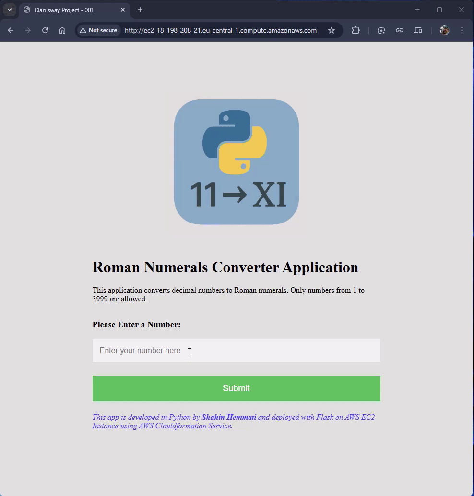

# Project 2: Roman Numerals Converter Application

This project showcases how to automate the deployment of a Flask-based Roman Numeral Converter application on an AWS EC2 instance using AWS CloudFormation. The app is served using Gunicorn as the WSGI server and is fronted by Nginx acting as a reverse proxy. The entire infrastructure — including instance provisioning, package installation, and service configuration — is managed through a single CloudFormation template for seamless reproducibility and scalability.

**Project Diagram:**  


**App Demo:**  


### What it does:
- Creates an EC2 instance with:  
  - Latest Amazon Machine Image (AMI) available via SSM
  - An instance type defined via parameter, defaulting to `t2.micro`
  - An SSH key pair for secure SSH access  
  - An attached security group with:
    - Inbound rules for SSH (port 22) and HTTP (port 80)
    - Outbound rules allowing all traffic
- Bootstraps the EC2 instance using UserData, which:  
  - Updates the package list and installs:
     - `python3`, `pip`, and `nginx`
  - Starts and enables the Nginx web server  
  - Creates a project directory for the Roman Numerals Converter app
  - Sets up a Python virtual environment
  - Downloads the application files (HTML templates, static image, and Python app) from GitHub
  - Installs `Flask` and `Gunicorn` inside the virtual environment
  - Creates a systemd unit file to run Gunicorn as a persistent service
  - Starts and enables the Gunicorn service to run on port `8000`
  - Configures Nginx as a reverse proxy, forwarding traffic from port `80` to `Gunicorn` on `127.0.0.1:8000`
- Ensures all services start automatically on boot (nginx and roman-numerals-converter.service)

>🔐 Note: SSH access is open to the world (0.0.0.0/0). Restrict in production.

## Project Structure
```
├── app.py
├── CFN-Template.yaml
├── readme-files
├── README.md
├── setup.sh
├── static
│   └── applogo.png
└── templates
    ├── index.html
    └── result.html
```
Explanation of the files:
- `app.py`: Python script for the Flask application.
- `CFN-Template.yaml`: CloudFormation template for deploying the resources.
- `readme-files/`: Directory containing screenshots and other readme files.
- `setup.sh`: Shell script to set up the Flask application and Nginx server as reverse proxy.
- `static/`: Directory containing static files (e.g., images).
- `templates/`: Jinja2 HTML templates – Used by Flask to render the frontend. index.html is the main input form, and result.html displays the conversion result.

## Prerequisites
- AWS CLI installed and configured with appropriate permissions.
- An existing key pair in the AWS region where the stack will be deployed. make sure to replace the `shahin-key` parameter in the CloudFormation template with the name of your key pair.
- Make to change the region in the AWS CLI commands to the region where you want to deploy the stack.
- SSM parameter `/aws/service/ami-amazon-linux-latest/al2023-ami-kernel-default-x86_64` available for the latest Amazon Linux 2 AMI.

## Deployment Steps
1. **Create the CloudFormation Stack**
   Use the following command to create the stack:
   ```sh
   aws cloudformation create-stack --stack-name my-stack --template-body file://CFN-Template.yaml --region <your-region>
   ```

2. **Check the Status of the Stack**
   Use the following command to check the status of the stack:
   ```sh
   aws cloudformation describe-stacks --stack-name my-stack --region <your-region>
   ```

3. **Access the Website URL**
   Once the stack is created successfully, you can access the website using the DNS address of the EC2 instance in the output section of the stack.
   ```
   aws cloudformation describe-stacks --stack-name my-stack --query "Stacks[0].Outputs[?OutputKey=='WebsiteURL'].OutputValue" --output text | cat
   ```

4. **Update the Stack**
   To update the stack, use the following command:
   ```sh
   aws cloudformation update-stack --stack-name my-stack --template-body file://CFN-Template.yaml --region <your-region>
   ```

5. **Delete the Stack**
   To delete the stack, use the following command:
   ```sh
   aws cloudformation delete-stack --stack-name my-stack --region <your-region>
   ```

### About setup-with-pip.sh vs. setup-with-uv.sh
Both scripts serve the same purpose: setting up the Python environment and installing the required dependencies. The key difference lies in how the dependencies are installed:
setup-with-pip.sh uses the traditional pip installer.
setup-with-uv.sh uses uv, a modern Rust-based alternative that is significantly faster.
The reason both are included is to highlight the performance difference between pip and uv.
Here’s a simple benchmark comparison:
```sh
# Using uv
time uv add flask gunicorn
# Output:
real    0m0.098s
user    0m0.060s
sys     0m0.030s  

# Using pip
time pip install flask gunicorn
# Output:
real    0m2.190s
user    0m1.770s
sys     0m0.118s
```
As you can see, uv installs packages nearly 20× faster in this case.  
⚠️ Note: The actual speedup may vary based on network, system load, and caching.