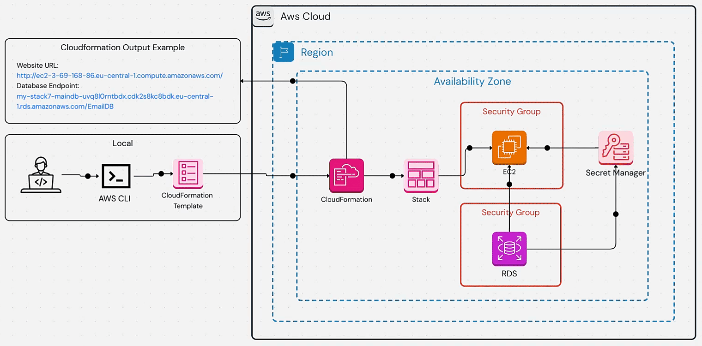
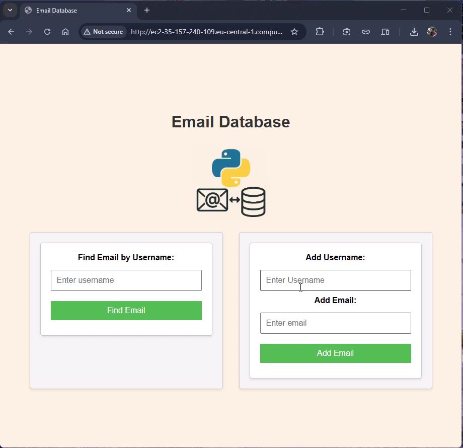

Project 3: Email Database
========================

### Project Goal
The goal of this project is to automate the deployment of a Flask application on AWS using CloudFormation. The application is a simple email database that allows users to add and retrieve email addresses. The application uses AWS RDS for the database and AWS Secret Manager for storing the database credentials.

### Tech Stack
- Python Flask -> Web framework
- AWS CloudFormation -> Infrastructure as Code
- Boto3 -> Used to retieve the database credentials from AWS Secret Manager
- AWS Secret Manager -> Used to store the database credentials
- Gunicorn -> WSGI HTTP server for UNIX
- Bash -> Used as a glue to bring everything together

### Project Diagram


### App Demo


### Project Structure
```bash
├── app.py
├── CFN-Template.yaml
├── readme-files
│   ├── appdemo.gif
│   └── EmailDB.gif
├── README.md
├── requirements.txt
├── setup-with-pip.sh
├── static
│   ├── applogo.png
│   └── style.css
├── templates
│   └── index.html
└── tests
    ├── db-conn-test.py
    └── fetch-secret-test.py
```
Explanation of the files:
- `app.py`: The main Flask application file that contains the logic for adding and retrieving email addresses.
- `CFN-Template.yaml`: The CloudFormation template that defines the infrastructure resources needed for the application.
- `readme-files`: Directory containing the project diagram and app demo GIFs.
- `README.md`: This file.
- `requirements.txt`: The file that lists the Python dependencies for the application.
- `setup-with-pip.sh`: A shell script that sets up the environment and installs the required packages.
- `static`: Directory containing static files such as CSS and images.
- `templates`: Directory containing HTML templates for the Flask application.
- `tests`: Directory containing test files for the application.
  - `db-conn-test.py`: A test file that checks the database connection.
  - `fetch-secret-test.py`: A test file that checks the retrieval of secrets from AWS Secret Manager.

### CloudFormation Template Explanation
The CloudFormation template is divided into several sections:
- **Parameters**: This section defines the parameters that can be passed to the template when creating the stack. It includes parameters for the Database name, Database Username, Allocated storage for DB, DB Instance type, key pair name, EC2 security group, and EC2 instance type.
- **Resources**: This section defines the resources that will be created when the stack is deployed. It includes:
  - EC2 Resources:
    - An EC2 instance that runs the Flask application and is configured with an IAM role plus a UserData script to install the required packages and run the application.
    - An IAM role for the EC2 instance to access AWS Secret Manager.
    - A security group for the EC2 instance to allow inbound traffic on ports 80 and 22.
  - RDS Resources:
    - An RDS instance that serves as the database for the application.
    - A DB-EC2-Security group that allows inbound traffic on port 3306 from the EC2 instance.
    - DB Password is stored in AWS Secret Manager.
- **Outputs**: This section defines the outputs of the stack, including the URL of the website and DB Endpoint.

### Prerequisites
- AWS CLI installed and configured with appropriate permissions.
- An existing key pair in the AWS region where the stack will be deployed. make sure to replace the shahin-key parameter in the CloudFormation template with the name of your key pair.
- An existing security group in the AWS region where the stack will be deployed that allows ports 80 and 22.
- Make sure to change the region in the AWS CLI commands to the region where you want to deploy the stack.
- SSM parameter /aws/service/ami-amazon-linux-latest/al2023-ami-kernel-default-x86_64 available for the latest Amazon Linux 2 AMI.

### Deployment Steps
1. **Create the CloudFormation Stack**
   Use the following command to create the stack:
   ```sh
   aws cloudformation create-stack --stack-name my-stack --template-body file://CFN-Template.yaml --region <your-region> --capabilities CAPABILITY_IAM
   ```

2. **Check the Status of the Stack**
   Use the following command to check the status of the stack:
   ```sh
   aws cloudformation describe-stacks --stack-name my-stack --region <your-region>
   ```

3. **Access the Website URL**
   Once the stack is created successfully, you can access the website using the DNS address of the EC2 instance in the output section of the stack.
   ```
   aws cloudformation describe-stacks --stack-name my-stack --query "Stacks[0].Outputs[?OutputKey=='WebsiteURL'].OutputValue" --output text | cat
   ```

4. **Update the Stack**
   To update the stack, use the following command:
   ```sh
   aws cloudformation update-stack --stack-name my-stack --template-body file://CFN-Template.yaml --region <your-region> --capabilities CAPABILITY_IAM
   ```

5. **Delete the Stack**
   To delete the stack, use the following command:
   ```sh
   aws cloudformation delete-stack --stack-name my-stack --region <your-region>
   ```