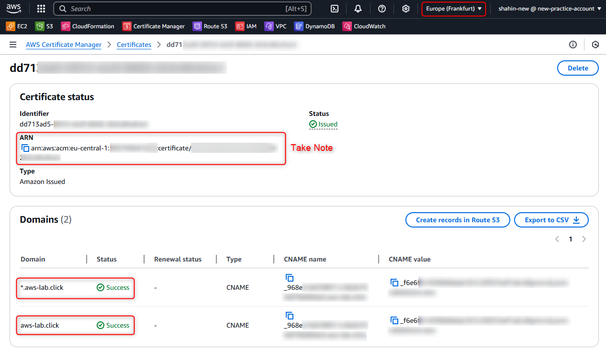
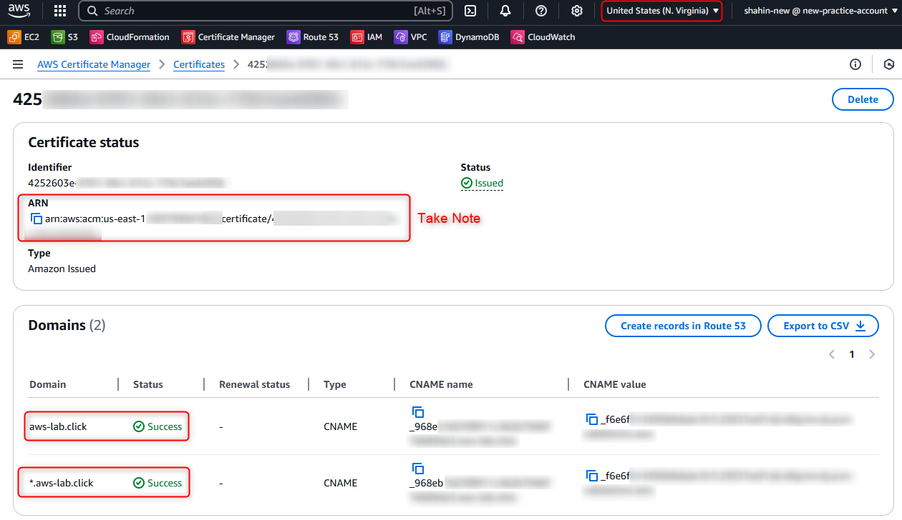
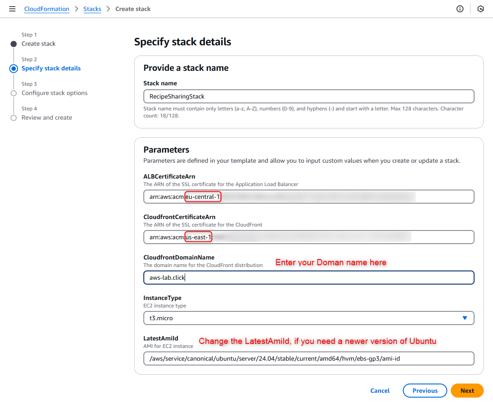
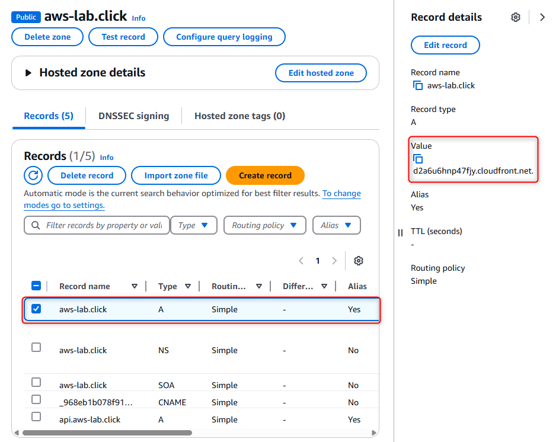
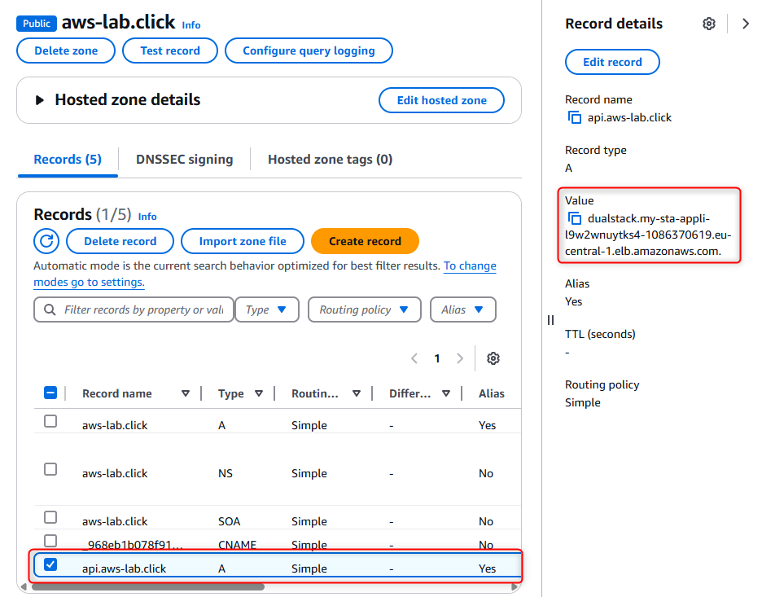

Project 4: Recipe Sharing App
=============================

### Project Goal
The goal of this project is to create a recipe sharing application using AWS services. The application will allow users to share their favorite recipes and view recipes shared by others. The project will be deployed using AWS CloudFormation, which will automate the deployment process and ensure that all resources are created in a consistent manner.

### Resources created by the CloudFormation stack:
**Frontend:**
- CloudFront
- S3  

**Backend:**
- 1 VPC
- 2 public subnets
- 2 private subnets
- 1 NAT gateway
- 1 ALB
- Auto Scaling group

**Database:**
- DynamoDB

### Pre-requisites:
- You must have a domain name registered with a domain registrar. This can be done through AWS Route 53 or any other registrar but AWS Route 53 is recommended for easier setup.
- You must have a hosted zone created in AWS Route 53 for your domain. This is necessary for managing DNS records and validating the certificate.
- If you decide to deploy the solution in any region other than `eu-central-1`, you should create certificate twice because cloudfront requires the certificate to be in `us-east-1` region. but if you deploy the solution in `eu-central-1` region, you can use the same certificate for both cloudfront and ALB.  
- After issuing the certificate, you will need to take note of Certificate ARN(s). This is a unique identifier for the certificate and will be used in the CloudFormation stack.

**How to request a certificate in ACM:**  
Refer to this video for a step-by-step guide on how to request a certificate in AWS Certificate Manager (ACM): [Requesting a Public Certificate](https://www.youtube.com/watch?v=YEIuuVKIy8U).

How your domain should look like in ACM:
Certificate for `*.yourdomain.com` and `yourdomain.com` which will be used for CloudFront and ALB.  
Example of ACM configuration for ALB:  
  
Example of ACM configuration for CloudFront:  



### Deployment Steps
**Deploy using AWS Console:**  
  

**Deploy using AWS CLI:**  
**Create the Stack**  
```sh
aws cloudformation create-stack \
  --stack-name my-stack \
  --template-body file://CFN-Template.yaml \
  --region <your-region> \
  --capabilities CAPABILITY_IAM \
  --parameters file://parameters.json
```
> Make sure to replace `<your-region>` with the AWS region where you want to deploy the stack and also update the `parameters.json` file with your own values.

**Check the Status of the Stack**
Use the following command to check the status of the stack:
```sh
aws cloudformation describe-stacks --stack-name my-stack --region <your-region>
```

**Update the Stack**
To update the stack, use the following command:
```sh
aws cloudformation update-stack \ 
  --stack-name my-stack \ 
  --template-body file://CFN-Template.yaml \
  --region <your-region> \
  --capabilities CAPABILITY_IAM \
  --parameters file://parameters.json
```

**Delete the Stack**
To delete the stack, use the following command:
```sh
aws cloudformation delete-stack \ 
  --stack-name my-stack \ 
  --region <your-region>
```

**Complete the Deployment**
Once the S3 bucket is created, you will need to upload the frontend files to the S3 bucket. You can do this using the AWS CLI or the AWS Management Console.
To build the front end, first edit `frontend/src/configs/configs.tsx` to update the URL of the API like:
```
export const API_URL = "https://api.aws-lab.click";
``` 
Then go back to frontend directory and run the following command to build the frontend:
```sh
npm run build
```
After that, you can upload the contents of the `frontend/dist` directory to the S3 bucket created by the CloudFormation stack. You can do this using the AWS CLI or the AWS Management Console.
To upload the files using the AWS CLI, run the following command:
```sh
aws s3 cp . s3://<Your-Bucket-Name-Here>/ --recursive
```
> Make sure to replace `<Your-Bucket-Name-Here>` with the name of the S3 bucket created by the CloudFormation stack.

Then update the Route53 records to correctly point to your CloudFront and ALB.  
  
  

Congratulations! You have successfully deployed the recipe sharing application using AWS CloudFormation. You can now access the application using the domain name you registered and configured in Route 53.