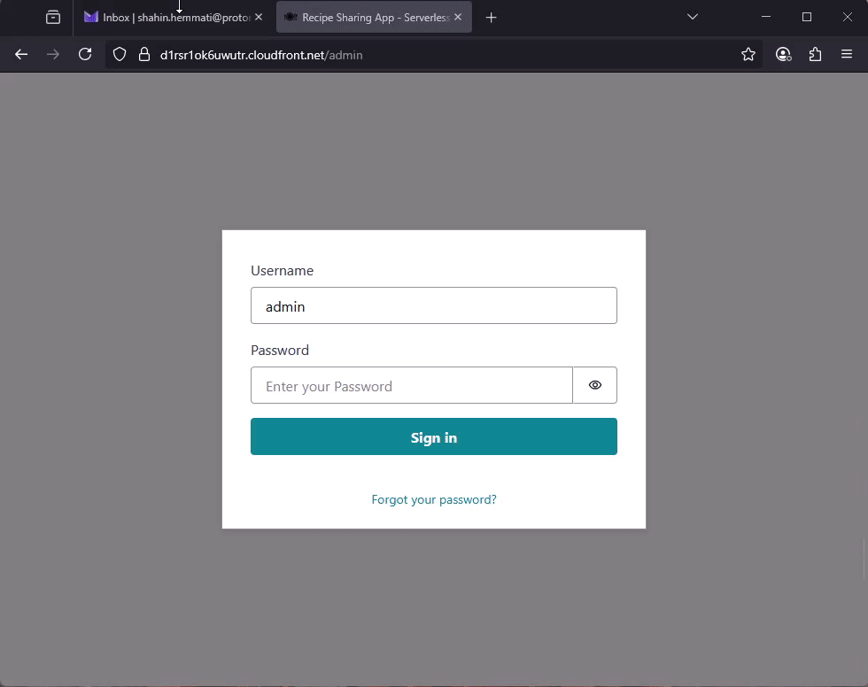

### Project Goal
Create a serverless version of the recipe sharing app using AWS Lambda and API Gateway and deploy it using a GitHub Actions CI/CD pipeline with AWS CloudFormation.

### Architecture


### App Demo


### Used Services 
| Components      | Services                                                                                                     |
|-----------------|--------------------------------------------------------------------------------------------------------------|
| Frontend        | - CloudFront<br>- S3                                                                                         |
| Backend         | - 1 API Gateway<br>- 5 API Endpoints<br>- 5 Lambda Functions<br>- Amazon Cognito                             |
| Database        | - DynamoDB                                                                                                   |
| CI/CD Pipeline  | - GitHub Actions<br>- AWS CloudFormation                                                                     |

### Cost Analysis
This pricing analysis provides a rough estimate and may vary significantly based on actual usage patterns, such as cache efficiency, payload sizes, and the number of active users.
**Example:** If you have 1 million requests per month, the **estimated cost** would be: 
| Service                                  | Cost                                                                |
|------------------------------------------|---------------------------------------------------------------------|
| API Gateway (HTTP API + Data Transfer)   | $1.20 (free for the first 12 months)                                |
| Lambda                                   | $0.20 (free for the first 12 months)                                |
| DynamoDB (On-demand)                     | $1.30 (free for the first 12 months)                                |
| S3 (1.55MB Storage)                      | $0.00003709 (free for the first 12 months)                          |     
| CloudFront (1,513.67 GB transfer)        | $128.66 (free for the first 12 months)                              |
| Cognito                                  | $14,850 (free tier of 10,000 monthly active users (MAU) per month)  | 
| **Total**                                | **~$14,981.37**                                                     | 

**Assumptions:**
- Each request results in approximately 1.55 MB of data being transferred.
- Low CloudFront cache hit ratio (worst-case scenario).
- All 1 million users log in at least once per month (counted as MAU for Cognito).
- Pricing is based on EU-Central-1 region.
- All costs are assumed to be outside of the free tier.

### Pre-requisites:
- You must configure your AWS credentials in your GitHub repository. This can be done by creating a new secret in your GitHub repository settings. The secret should contain the following keys:
  - `AWS_ACCESS_KEY_ID`
  - `AWS_SECRET_ACCESS_KEY`
- Change the parameters in cloudformation template to match your environment.
- To lower the deployment time, when you decided to add a new lambda function with 3rd party libraries, its better to create a lambda layer and add the layer to your lambda function definition in the cloudformation template.  
Example of lambda layer definition in the cloudformation template:
  ```yaml
    PostRecipeLambdaFunction:
      Type: AWS::Lambda::Function
      Properties:
        FunctionName: post-recipe
        Runtime: python3.9
        Handler: index.lambda_handler
        Code:
          S3Bucket: !Ref LambdasBucketName
          S3Key: lambdas/post-recipe.zip
        Role: !GetAtt LambdaExecutionCreateRecipeRole.Arn
        Timeout: 60
        Layers:
          - !Sub arn:aws:lambda:${AWS::Region}:017000801446:layer:AWSLambdaPowertoolsPythonV2:68   
  ```

### About CI/CD Pipeline
Here are the steps that the pipeline performs:
1. The pipeline checks out the code from the GitHub repository.
2. Sets up the AWS CLI and configures the credentials.
3. It ensures that the S3 bucket for lambda functions exists.
3. Zip the lambda functions
4. Upload the zipped lambda functions to the S3 bucket.
5. Deploy the CloudFormation stack using the `aws cloudformation deploy` command.
6. Build and deploy the frontend to the specified S3 bucket so that it can be served by CloudFront.  

Notes:
- The CI/CD pipeline configuration file is [here](https://github.com/shahinam2/AWS-DevOps-Projects/blob/main/05_Recipe_Sharing_App_Serverless_Edition/CICD/deploy.yml).  
- You can view a successful CI/CD pipeline run on GitHub Actions [here](https://github.com/shahinam2/AWS-DevOps-Projects/actions/runs/14596128230/job/40942369012)

### Further Work & Optimisation
- Optimise how lambda functions are zipped and deployed. For example, only deploy the functions that have changed.
- Add user sign up functionality to the app.
- Add a step to the pipeline to run unit tests before deploying the code.
- Add HTTPS

---

### Notes
- This project is a demonstration of how to deploy a recipe sharing application using AWS services. It is not intended for production use and should be used for educational purposes only. The code and resources provided in this project are provided "as is" without warranty of any kind, either express or implied. **Use it at your own risk**.
- For better **observability and monitoring**, you can integrate AWS CloudWatch or any preferred solution to monitor the application and set up alarms for any issues that may arise.
- For better security, you can implement **AWS WAF** (Web Application Firewall) to protect your application from common web exploits and bots.
- This project is an enhanced version of the **AWS Cloud Projects** book, Chapter 4 by **Ivo Pinto & Pedro Santos**. You can find the book [here](https://www.packtpub.com/en-us/product/aws-cloud-projects-9781835889282).