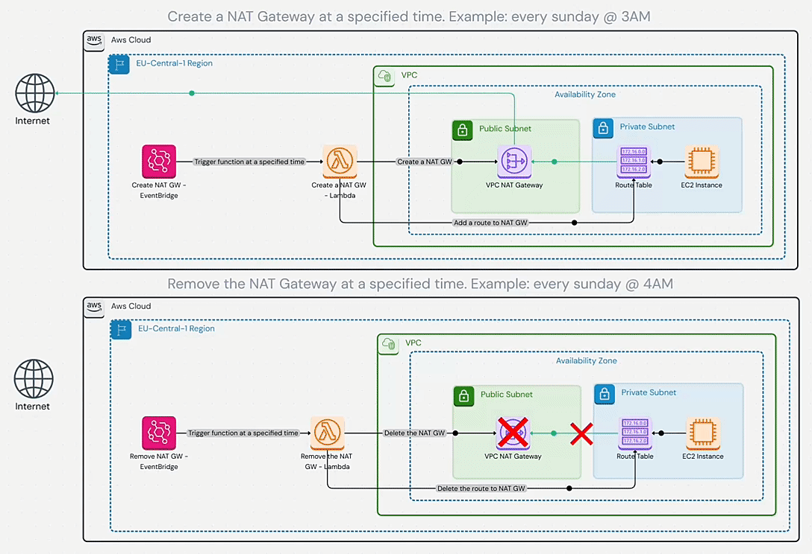

### Project Overview: Disposable NAT Gateway for Cost-Effective and Secure AWS Networking
This project provides a disposable NAT Gateway solution designed to lower costs and improve security in AWS environments. The NAT Gateway is created only for a defined time window and automatically destroyed afterward. This model fully utilizes AWS’s pay-as-you-go pricing, ensuring that you only pay for the NAT Gateway while it’s actually needed.

**Why This Project?**  
The idea for this solution came from a discussion with a colleague about the high ongoing costs of NAT Gateways in AWS, alongside the operational risks of self-managed NAT Instances. Instead of keeping a NAT Gateway active at all times, this project enables you to spin up the gateway temporarily—reducing your attack surface and cutting unnecessary costs.

**How It Works**  
To use this disposable NAT Gateway effectively, the developer must configure their application to perform updates within a specified time window. This time window should include a small buffer period at the beginning to allow the NAT Gateway to be deployed and become fully operational before the application’s update process starts.

For example, if your app's update is scheduled to begin at 02:10 AM, you might define the NAT Gateway’s availability window from 02:00 AM to 03:00 AM. This ensures that the NAT Gateway is ready when the update begins and is safely removed afterward.

**Who Is This For?**  
This solution is ideal for developers and teams who need outbound internet access (via NAT) during specific operations like nightly updates or scheduled batch jobs—but do not require NAT availability around the clock. It helps keep your infrastructure lean, secure, and cost-effective without manual intervention.

### Architecture
  

### Used Services:
- EventBridge
- AWS Lambda
- CloudFormation

### Pre-requisites:
There are 4 parameters that you should provide to the cloudformation template:
1. **PublicSubnet:** The ID of the public subnet where the NAT Gateway will be created.
2. **PrivateRouteTable:** The ID of the private route table to which the NAT Gateway route will be added.
3. **CreateNATGWScheduleExpression:** A cron schedule expression for creating the NAT Gateway at a specific time. 
   - Example: `cron(0 12 * * ? *)` will create the NAT Gateway every day at 12:00 PM UTC.
   - Note: The schedule expression must be in UTC time zone.
4. **DeleteNATGWScheduleExpression:** A cron schedule expression for deleting the NAT Gateway.
   - Same as above, but for deleting the NAT Gateway.

### How to deploy the solution:
Fetch the cloudformation template from the repository:
```bash
wget https://raw.githubusercontent.com/shahinam2/AWS-DevOps-Projects/refs/heads/main/06_Disposable_NAT_Gateway/CFN-Template.yaml
```
And deploy it using the AWS CLI or AWS Management Console.
Using the AWS CLI:
```bash
aws cloudformation create-stack --stack-name DisposableNATGateway --template-body file://CFN-Template.yaml --parameters ParameterKey=PublicSubnet,ParameterValue=<Your-Public-Subnet-ID-Here> ParameterKey=PrivateRouteTable,ParameterValue=<Your-Private-RT-ID-Here> ParameterKey=CreateNATGWScheduleExpression,ParameterValue="Your-Start-Cron-as-String-Here" ParameterKey=DeleteNATGWScheduleExpression,ParameterValue="Your-End-Cron-as-String-Here"
```
Using the AWS Management Console:
1. Go to the CloudFormation service in the AWS Management Console.
2. Click on "Create stack" and select "With new resources (standard)".
3. Upload the cloudformation template file and click "Next".
4. Provide the stack name and the parameters mentioned above.
5. Click "Next" and review the stack details.
6. Click "Create stack" to create the stack.

**Parameters example:**


### Cron schedule expression cheatsheet:

**Syntax Format:**  
`cron(Minutes Hours Day-of-Month Month Day-of-Week Year)`

**Field Breakdown:**  
| Field | Allowed Values | Meaning |
|-------|----------------|---------|
| Minutes | 0–59 | Minute of the hour |
| Hours | 0–23 | Hour of the day (UTC!) |
| Day-of-Month | 1–31, ? | Day of the month, or ? if unused |
| Month | 1–12 or JAN-DEC | Month |
| Day-of-Week | 1–7 or SUN-SAT | 1 = Sunday, 2 = Monday, ..., 7 = Saturday |
| Year | 1970–2199, * | Year |

**Day-of-Week Table (Critical in AWS!):**
| Day | Number | AWS Keyword |
| ---|-------|------------- |
| Sunday | 1 | SUN |
| Monday | 2 | MON |
| Tuesday | 3 | TUE |
| Wednesday | 4 | WED |
| Thursday | 5 | THU |
| Friday | 6 | FRI |
| Saturday | 7 | SAT |

**Example Expressions:**
| Example        | Expression |
|----------------|------------|
| Every day at 5 PM UTC | cron(0 17 * * ? *) |
| Every Sunday at 3 AM UTC | cron(0 3 ? * 1 *) |
| Every Monday and Wednesday at 9 AM UTC | cron(0 9 ? * 2,4 *) |
| Every 10th of the month at 6 AM UTC | cron(0 6 10 * ? *) |
| Every Friday at 11:30 PM UTC | cron(30 23 ? * 6 *) |

### Further Work & Optimisation
- Add a CloudWatch alarm to monitor the NAT Gateway and notify when it is created or deleted.
- Expand the solution to support multiple NAT Gateways.
- Separate the lambda functions from the CloudFormation template for better modularity.

---

### Notes
- This project is a proof of concept and should not be used in production without further testing and validation. Use at your own risk.
- The project is not affiliated with AWS and is not endorsed by AWS. It is an independent project created for educational purposes.
- The project is open source and licensed under the MIT License. Feel free to use, modify, and distribute the code as you see fit.
