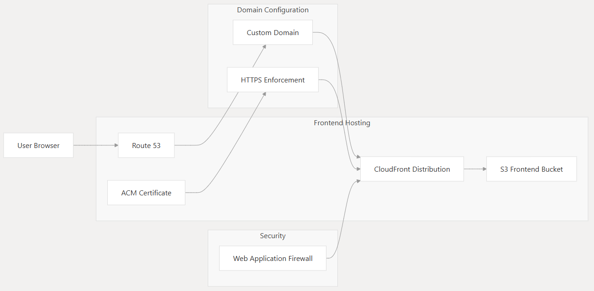
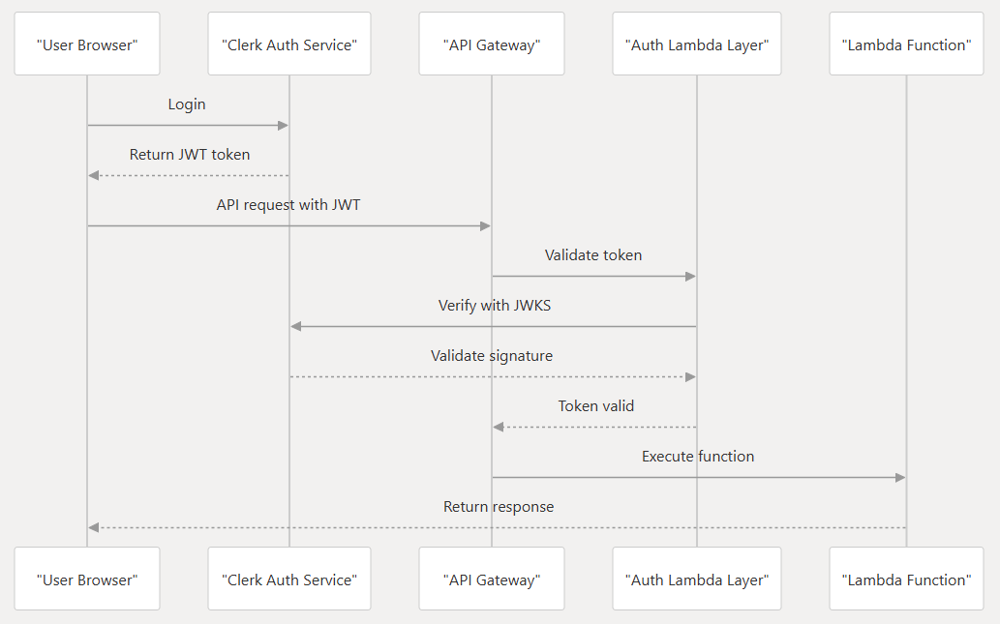
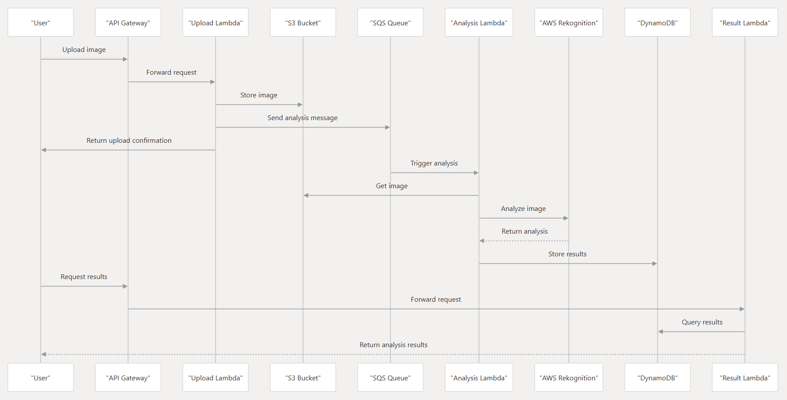
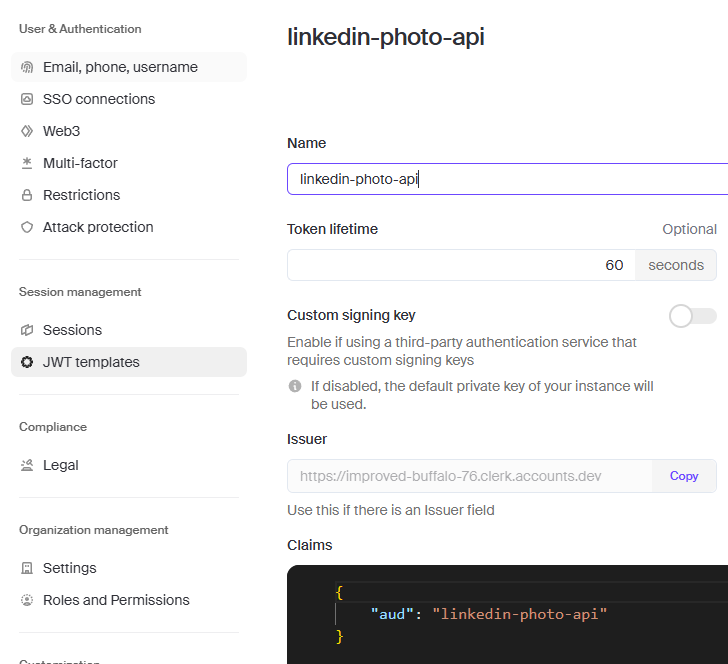

Project 7: LinkedIn Profile Picture Analyzer
=============================

### Table of Contents
- [Architecture](#architecture)
- [Project Overview](#project-overview)
- [Project Architecture & Flows](#project-architecture--flows)
- [App Demo](#app-demo)
- [Used Services](#used-services)
- [Pre-requisites](#pre-requisites)
- [How to Deploy](#how-to-deploy)
- [Cost Analysis](#cost-analysis)
- [Notes](#notes)

---

### Architecture
  

### Project Overview 

This project is a LinkedIn Profile Picture Analyzer that uses AWS services to analyze and process profile pictures. The application is designed to be serverless, scalable, and cost-effective. It leverages AWS Lambda, Amazon S3, Amazon Rekognition, and Amazon DynamoDB to provide a seamless experience for users.

---

### Project Architecture & Flows
In the following flow diagrams you can see the flow of different components of the project.

**Frontend Architecture:**  

**Authentication Flow:**

**Backend Flow: Image processing**

---

### App Demo

---

### Used Services

| **Category**              | **Services**                                                                 |
|---------------------------|-----------------------------------------------------------------------------|
| **Backend**               | API Gateway, AWS Lambda, Amazon Rekognition, Amazon DynamoDB, SQS          |
| **Frontend**              | S3, CloudFront, Route 53, AWS Certificate Manager, WAF                     |
| **Authentication Service**| Clerk                                                                      |
| **Infrastructure as Code**| Terraform                                                                  |
| **CI/CD**                 | GitHub Actions                                                            |
| **Languages**             | JavaScript (Frontend), Python (Backend)                                   |

---

### Pre-requisites:
- AWS Account
- Domain Name
- In the Infrastructure directory you will find a variable file called `variables.tf`. make sure to update the all of the variables in the file.
  - JWKS_URL -> The JWKS URL for your Clerk application. You can find this in the Clerk dashboard -> API Keys -> Frontend API URL
  - AWS_REGION -> The AWS region where you want to deploy the application. For example, eu-central-1.
  - ACM_CERTIFICATE_ARN -> The ARN of the ACM certificate for your domain. You can create a new certificate in the AWS Certificate Manager. Make sure to create the certificate in us-east-1 region.
  - HOSTED_ZONE_NAME -> The name of the hosted zone for your domain. You can create a new hosted zone in AWS Route 53 or use an existing one.
  SUBDOMAIN -> In this project, I used a subdomain, but you can use the root domain as well.
  - Clerk Account  

After signing up and creating a new application, make sure that you create a JWT template like this:  

---

### How to Deploy
1. Clone/Fork the repository
2. Navigate to the `infrastructure` directory
3. Update the `variables.tf` file with your AWS and Clerk account details
4. Run `terraform init` to initialize the Terraform configuration
5. Run `terraform plan` to see the resources that will be created
6. Run `terraform apply` to create the resources
This creates the infrastructure for the application. 
The infrastructure includes:
  - API Gateway
  - Lambda Functions
  - DynamoDB Table
  - S3 Buckets
  - CloudFront Distribution
  - Route 53 Hosted Zone
  - WAF

For the frontend, you should add a slight change to the `index.html` file and push it. That will trigger the GitHub Actions workflow and deploy the frontend to S3.  
This project is created in a way that you can deploy the backend and frontend separately.  
Backend has its own GitHub Actions workflow and frontend also has its own GitHub Actions workflow separately.  
So, when you make a change to your frontend code, you don't have to wait for the backend to be deployed again. You can just push the changes to the `main` branch and the GitHub Actions workflow will take care of the rest.

---

### Cost Analysis
The following is a cost analysis of 1 million users that each upload 10 images per month. 

AWS services: $8,882.36  
Clerk authentication: $19,825  
Total: **$28,707.36 per month**  

Notes:
- You can have a look at AWS services cost details <a href="https://calculator.aws/#/estimate?id=b35b930a37c20174a67a7625601a25a706277799">here</a>.
- You can save $16,875 per month by using Supabase instead of Clerk.
- The project is deployed in the `eu-central-1` region.
- Public SSL/TLS certificates provisioned through AWS Certificate Manager (ACM) are free.
- This cost analysis assumes that the project owner does not have any free tier credits left.
- The cost is calculated based on the AWS pricing as of May 2025. 
- The actual cost may vary based on the region and usage.

---

### Notes
- This project is a proof of concept and should not be used in production without further testing and validation. Use at your own risk.
- The project is not affiliated with AWS and is not endorsed by AWS. It is an independent project created for educational purposes. 
- By adding test cases, monitoring, and logging, you can make the project production-ready.
- The files stored in the S3 bucket are deleted after 1 day. You can change the lifecycle policy in the S3 bucket to keep the files for a longer period of time.
- To reduce the cost of the project, you can switch from clerk to supabase.
- After finishing almost the entire project, I started adding WAF to the project. WAF supports RestAPI but not HTTP API. So, I had to change the API Gateway from HTTP API to RestAPI or add a cloudfront distribution in front of the HTTP API. I chose to omit the WAF for now. But, for the next project, I will remember that WAF does not support HTTP API.
- The project is open source and licensed under the MIT License. Feel free to use, modify, and distribute the code as you see fit.
- Contributions are welcome! If you have any suggestions or improvements, please create a pull request or open an issue.