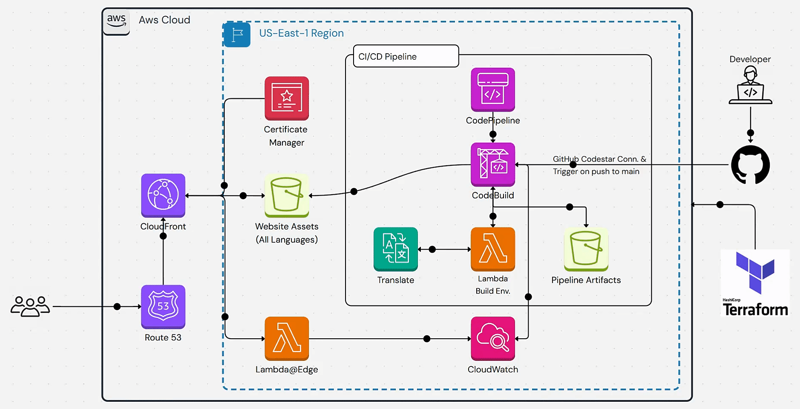
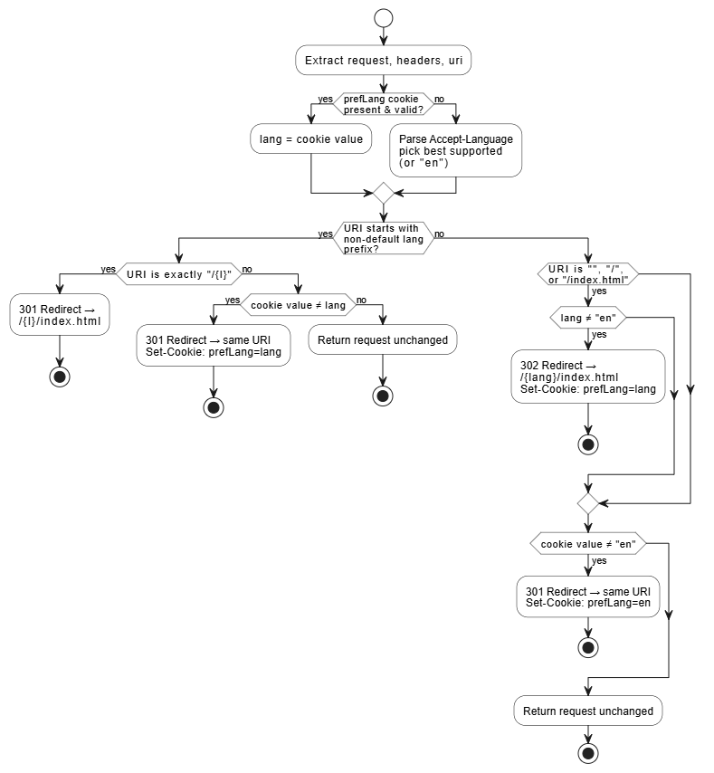
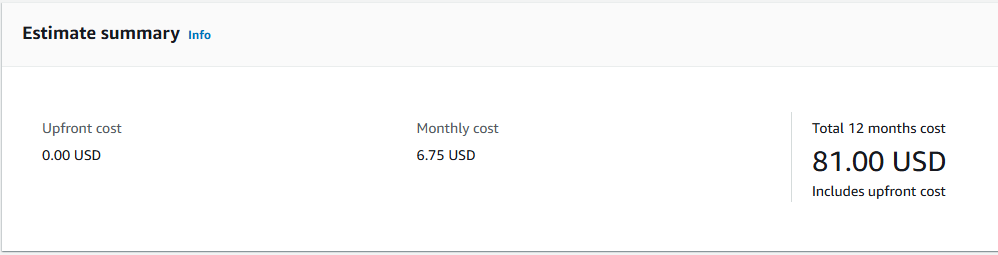
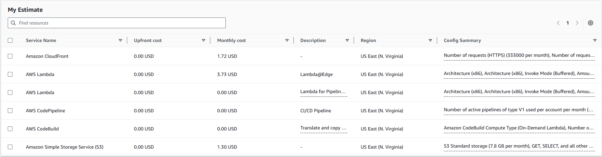

### Table of Contents
- [Architecture](#architecture)
- [Project Overview](#project-overview)
- [Project Demo](#project-demo)
- [Lambda@Edge explained](#lambdaedge-explained)
- [Used Services](#used-services)
- [Pre-requisites](#pre-requisites)
- [How to Deploy](#how-to-deploy)
- [Cost Analysis](#cost-analysis)
- [Notes](#notes)

---

### Architecture


---

### Project Overview 
Think of this stack as a fully automated, multilingual static‑site machine.
Whenever we push to main on GitHub, an event shoots through a CodeStar Connection and wakes up an AWS CodePipeline. 
The pipeline pulls the repo, then hands the code to CodeBuild, which runs a lightweight build container (defined in Terraform) to bundle the HTML/CSS/JS and call Amazon Translate to turn the base English pages into Spanish, Hindi, French, etc. 
The translated and original files are pushed into a versioned pipeline‑artifacts S3 bucket, and finally copied to the public website‑assets bucket that CloudFront sits in front of.

At the edge, a tiny Lambda@Edge function watches every viewer request. It decides which language folder a visitor should get, based on a cookie or the browser’s Accept‑Language, and issues a fast redirect so the right HTML lands in the browser. Because the bucket is private, CloudFront uses an Origin Access Control(OAC) key to read the files; the world sees only CloudFront’s HTTPS endpoint, secured by a cert from AWS Certificate Manager and wired to the domain through Route 53.

Developers never touch the AWS console. All the plumbing—buckets, policies, CloudFront distro, Lambda versions, IAM roles, the CI/CD pipeline itself, is declared in Terraform and lives in the same repo. Push code, get a refreshed, multilingual site in a few seconds. Logs from both the build and edge runtime flow into CloudWatch, so we can trace a failing translation or catch 404s in real time.

In short: commit → pipeline translates & ships → CloudFront + Lambda@Edge serve language‑aware pages at global speed, all scripted with Terraform so we can tear it down or spin it up with one command.

---

### Project Demo


**This Demo has 2 parts:**
1. Showing the effect of the Lambda@Edge function when no cookie is set.
   - For each language to show the effect, I remove the cookie and try to access the main page.
2. Showing the effect of the Lambda@Edge function when a cookie is set using the language picker.

---

### Lambda@Edge explained
**Why we need it**  
CloudFront can’t natively pick a page version based on a viewer’s language, nor can it map every “pretty” folder URL (`/es/`) to an object (`/es/index.html`) when you use a private S3 origin. A viewer‑request Lambda@Edge lets us intercept the request before CloudFront looks in its cache or talks to S3, decide which language to serve, and in a single round‑trip, return a 30x redirect that the browser follows. Because CloudFront can return responses generated by the function directly to the viewer, the origin is never touched for these decisions

**What the function does (high‑level)**  
**1.Work out the visitor’s preferred language**
- If the browser already carries a `prefLang` cookie (set by us earlier), trust it.
- Otherwise parse `Accept‑Language`, honouring `q` weights, and select the first code we support (`en`, `es`, `zh`, `ar`, `hi`, `fr`). If nothing matches, fall back to English.

**2.Requests that already live under a language folder**
- `/es/index.html`, `/fr/about.html`, … are served untouched.
- A bare folder like `/es` is normalised with a 301 → `/es/index.html` (so crawlers don’t see duplicate URLs).
- If the visitor manually lands on, say, `/fr/…` but their cookie still says `hi`, we refresh the cookie with a one‑shot 301 so future root hits stay in French.

**3.Root requests (`/`, `/index.html`)**
- If the preferred language is not English we issue a 302 → `/<lang>/index.html` and set `prefLang=<lang>` for one year.
- English stays at the root—simpler URLs, better SEO.

**4.English pages with a non‑English cookie**
- We silently fix that mismatch with a 301 back to the same English URL and reset `prefLang=en`.

**5.Everything else**
- Pass straight through; CloudFront continues with its normal cache/origin flow.

**Why place it on the viewer‑request trigger?**
- That’s the first hook in the CloudFront lifecycle, so we can generate an HTTP response without the request ever touching the cache or S3.
- Viewer cookies are always included in the context event—even when we don’t forward them to the origin—so our prefLang logic has zero impact on the origin‑cache key .
- Redirect responses are cacheable; CloudFront stores the 301/302 the same way it would store an object, greatly reducing repeat work

**Why we redirect to `/xx/index.html` (not just `/xx/`)**  
With a private S3 REST origin + OAC, CloudFront treats the viewer URL literally.  
`/es/` would be forwarded as the key `es/`, which S3 rejects.  
A default root object only helps at the distribution root (/), not inside sub‑folders, so we send the browser to `/es/index.html` instead.

**Benefits of this approach**  
| Benefit                                   | How the function achieves it                                                                    |
| ----------------------------------------- | ----------------------------------------------------------------------------------------------- |
| Fast – one extra edge hop, no origin call | Redirect generated in‑place at the viewer‑request stage.                                        |
| SEO‑friendly                              | Canonical English at /, permanent redirects for trailing‑slash fixes, language‑specific URLs.   |
| User‑controlled                           | Cookie lets the visitor override negotiation; picker switches language instantly and persists.  |
| No cache bloat                            | prefLang cookie never reaches S3, so the cache policy stays header‑ and cookie‑free.            |
| Secure bucket                             | Works with an OAC/private S3 REST origin; no need to switch to the public website endpoint.     |

Put simply, this Lambda@Edge acts as a lightweight traffic director: one cookie, a handful of 30x responses, and CloudFront plus S3 do the rest.

**Lambda@Edge Flowchart:**



---

### Used Services
| **Service**               | **Description**                                                                 |
|---------------------------|---------------------------------------------------------------------------------|
| **AWS CodePipeline**      | CI/CD pipeline to automate the build and deployment process.                    |
| **AWS CodeBuild**         | Build service to compile and package the application.                           |
| **AWS CodeStar Connections** | Service to connect AWS CodePipeline with GitHub for source control.           |
| **Amazon CloudFront**     | Content delivery network (CDN) to distribute the website globally with low latency. |
| **AWS Lambda@Edge**       | Serverless compute service to run code closer to users and customize content delivery. |
| **AWS Route 53**          | Domain name system (DNS) service to route traffic to the CloudFront distribution. |
| **AWS Certificate Manager** | Service to manage SSL/TLS certificates for secure HTTPS connections.           |
| **AWS Translate**         | Machine translation service to translate the website content into multiple languages. |
| **AWS CloudWatch**        | Monitoring and logging service to track application performance and errors.     |
| **Amazon S3**             | Object storage service to store the static website files.                       |
| **AWS IAM**               | Identity and Access Management to control access to AWS resources.              |
| **Terraform**             | Infrastructure as code (IaC) tool to define and manage the AWS resources.             |
| **GitHub**                | Source code repository to host the application code and trigger the CI/CD pipeline. |

---

### Pre-requisites
- AWS account with necessary permissions to create and manage the required services.
- GitHub account with a repository to host the application code.
- Terraform installed on your local machine for infrastructure provisioning.

---

### How to Deploy
1. Clone the repository to your local machine.
   ```bash
   git clone <repository-url>
   cd <repository-directory>
   ```
2. Configure AWS credentials on your local machine.
   ```bash
   aws configure
   ```
3. Update the followings in `variables.tf` file with your desired configuration:
- `website_bucket_name`: The name of the S3 bucket for all website content (multi-language)
- `codepipeline_bucket_name`: The name of the S3 bucket for CodePipeline artifacts
- `github_repository_url`: GitHub repository in the format `<owner>/<repo>`
- `website_URL`: The URL of the website (e.g., `example.com`)
- `certificate_arn`: The ARN of the SSL certificate for the domain (managed by ACM) which is stored in us-east-1 region
- `route53_zone_id`: The Route 53 hosted zone ID for adding an A record for the domain
4. Initialize & apply the terraform
   ```bash
   terraform init
   terraform plan  # Optional: Review the plan before applying
   terraform apply
   ```
5. Once the deployment is complete, the website will be accessible at the specified domain.

---

### Cost Analysis
The following are the estimated costs associated with the services used in this project for 1 million requests:

Total estimated cost: **$6.75 / Month** 

You can find the cost breakdown [here](https://calculator.aws/#/estimate?id=95bac2a701ab3624bceaebd39c43f04df5b98578)

In case AWS calculator is not available, here is the cost breakdown:

Estimated summary:



Details:



---

### Notes
- The project is open source and licensed under the MIT License. Feel free to use, modify, and distribute the code as you see fit.
- Contributions are welcome! If you have any suggestions or improvements, please create a pull request or open an issue.
