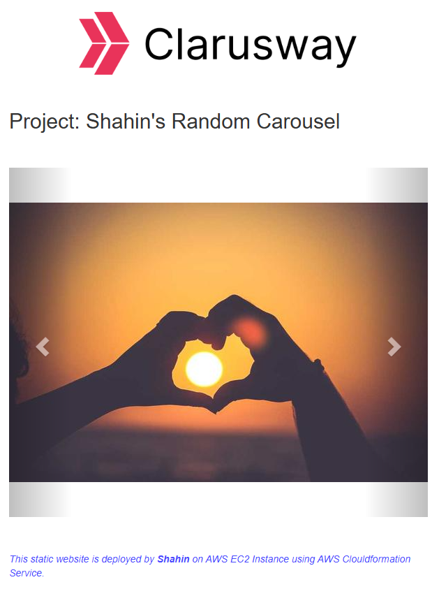

# Project 101: Random Image Carousel Static Website

This project demonstrates how to deploy a static website on an AWS EC2 instance using AWS CloudFormation. The website features a carousel of kitten images and is hosted on an Apache web server.


This CloudFormation template launches a t2.micro EC2 instance running Amazon Linux 2, installs Apache HTTP Server, and serves a static HTML file (index.html) from this repo.

💡 What it does:
- Uses the latest Amazon Linux 2 AMI via SSM.
- Installs and starts Apache on launch.
- Downloads the HTML from GitHub into /var/www/html.
- Opens ports 22 (SSH) and 80 (HTTP) via a security group.
- Outputs the public URL of the instance.
>🔐 Note: SSH and HTTP access are open to the world (0.0.0.0/0). Restrict in production.

How it looks:  


## Project Structure
```
├── CFN-Template.yaml  # CloudFormation template for deploying the resources
├── README  
└── static-website/  
    └── index.html  # HTML file for the static website
```

## Prerequisites
- AWS CLI installed and configured with appropriate permissions.
- An existing key pair in the AWS region where the stack will be deployed. make sure to replace the `shahin-key` parameter in the CloudFormation template with the name of your key pair.
- Make to change the region in the AWS CLI commands to the region where you want to deploy the stack.
- SSM parameter `/aws/service/ami-amazon-linux-latest/al2023-ami-kernel-default-x86_64` available for the latest Amazon Linux 2 AMI.

## Deployment Steps
1. **Create the CloudFormation Stack**
   Use the following command to create the stack:
   ```sh
   aws cloudformation create-stack --stack-name my-stack --template-body file://CFN-Template.yaml --region <your-region>
   ```
2. **Check the Status of the Stack**
   Use the following command to check the status of the stack:
   ```sh
   aws cloudformation describe-stacks --stack-name my-stack --region <your-region>
   ```
3. **Access the Website**
   Once the stack is created successfully, you can access the website using the DNS address of the EC2 instance in the output section of the stack.

4. **Update the Stack**
   To update the stack, use the following command:
   ```sh
   aws cloudformation update-stack --stack-name my-stack --template-body file://CFN-Template.yaml --region <your-region>
   ```

5. **Delete the Stack**
   To delete the stack, use the following command:
   ```sh
   aws cloudformation delete-stack --stack-name my-stack --region <your-region>
   ```


